# 1 内存管理

Go 的内存管理基本上参考 `tcmalloc` 来实现的，只是细节上根据自身的需要做了一些小的优化调整。

在 TCMalloc 内存管理内部分为两个部分：线程内存（thread memory)和页堆（page heap）。

1. 每一个线程都可以获得一个用于无锁分配小对象的缓存，这样可以让并行程序分配小对象（<=32KB）非常高效。PS, java 中叫TLAB：Thread Local Allocation Buffer。Go 中叫mcache（挂在每一个P上）
2. TCMalloc 管理的堆由一组页组成，**一组连续的页面被表示为 span**。当分配的对象大于 32KB，将使用页堆（Page Heap）进行内存分配。

>Go 的内存分配器基于 Thread-Cache Malloc (tcmalloc) ，tcmalloc 为每个线程实现了一个本地缓存， 区分了小对象（小于 32kb）和大对象分配两种分配类型，**其管理的内存单元称为 span**。但与 tcmalloc 存在一定差异。 这个差异来源于 Go 语言被设计为没有显式的内存分配与释放， 完全依靠编译器与运行时的配合来自动处理，因此也就造就了内存分配器、垃圾回收器两大组件。统一管理内存会提前分配或一次性释放一大块内存， 进而减少与操作系统沟通造成的开销，进而提高程序的运行性能。 支持内存管理另一个优势就是能够更好的支持垃圾回收。

## 1.1 池

程序动态申请内存空间，是要使用系统调用的，比如 Linux 系统上是调用 `mmap` 方法实现的。但对于大型系统服务来说，直接调用 `mmap` 申请内存，会有一定的代价。

1. 系统调用会导致程序进入内核态，内核分配完内存后，再返回到用户态。
2. 频繁申请很小的内存空间，容易出现大量内存碎片，增大操作系统整理碎片的压力。
3. 为了保证内存访问具有良好的局部性，开发者需要投入大量的精力去做优化，这是一个很重的负担。

假设系统需要频繁动态申请内存来存放一个数据结构，比如 `[10]int`。那么我们完全可以在程序启动之初，一次性申请几百甚至上千个 `[10]int`。这样完美的解决了上面遇到的问题：

1. 不需要频繁申请内存了，而是从对象池里拿，程序不会频繁进入内核态
2. 因为一次性申请一个连续的大空间，对象池会被重复利用，不会出现碎片。
3. 程序频繁访问的就是对象池背后的同一块内存空间，局部性良好。

这样做会造成一定的内存浪费，我们可以定时检测对象池的大小，保证可用对象的数量在一个合理的范围，少了就提前申请，多了就自动释放。如果某种资源的申请和回收是昂贵的，我们都可以通过建立**资源池**的方式来解决，其他比如**连接池**，**内存池**等等，都是一个思路。

## 1.2 内存池mheap

Go 的程序在启动之初，会一次性从操作系统那里申请一大块内存作为内存池。这块内存空间会放在一个叫 `mheap` 的 `struct` 中管理，mheap 负责将这一整块内存切割成不同的区域，并将其中一部分的内存切割成合适的大小，分配给用户使用。

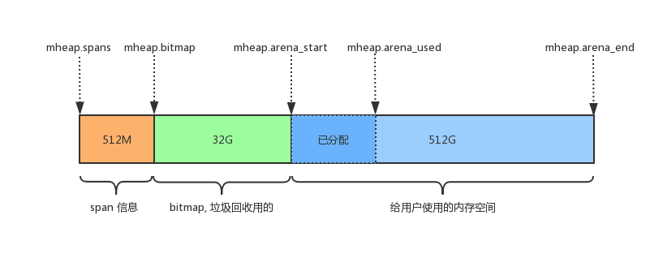


- `mheap.spans`：用来存储 `page` 和 `span` 信息，比如一个 span 的起始地址是多少，有几个 page，已使用了多大等等。

spans区域用于表示arena区中的某一页(Page)属于哪个span, spans区域中一个指针(8 byte)对应了arena区域中的一页(在go中一页=8KB)。所以spans的大小是 512GB / 页大小(8KB) * 指针大小(8 byte) = 512MB。spans区域的一个指针对应arena区域的一页的结构如下, 和bitmap不一样的是对应关系会从开头开始:

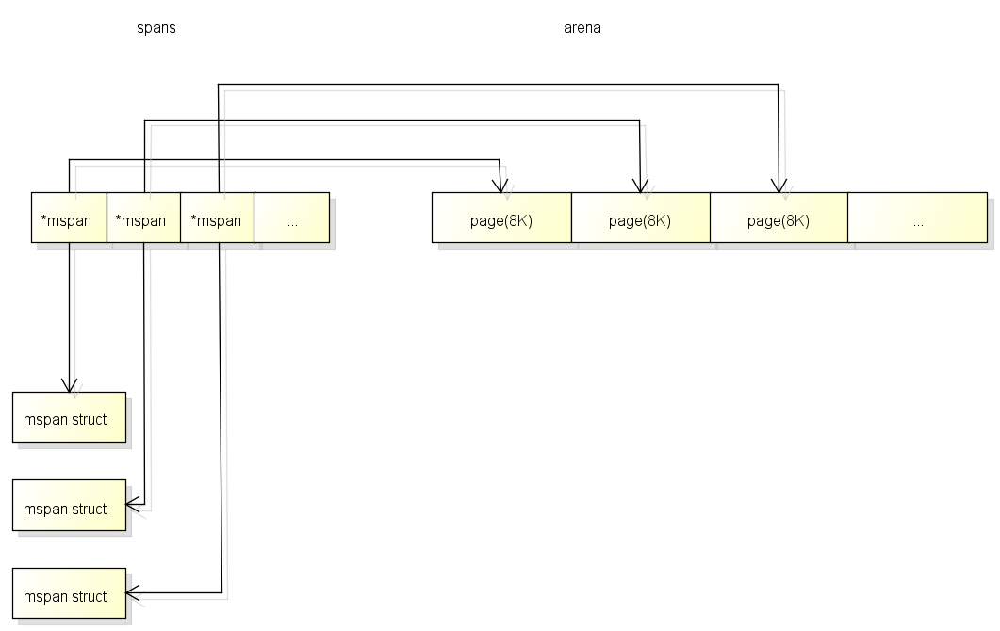

> 什么时候从Heap分配对象
>
> - 返回对象的指针
> - 传递了对象的指针到其他函数
> - 在闭包中使用了对象并且需要修改对象
> - 使用new

- `mheap.bitmap` 存储着各个 `span` 中对象的标记信息，比如对象是否可回收等等。

bitmap区域用于表示arena区域中哪些地址保存了对象, 并且对象中哪些地址包含了**指针**。bitmap区域中一个byte(8 bit)对应了arena区域中的四个指针大小的内存, 也就是**2 bit对应一个指针大小的内存**。所以bitmap区域的大小是 512GB / 指针大小(8 byte) / 4 = 16GB。bitmap区域中的一个byte对应arena区域的四个指针大小的内存的结构如下,**每一个指针大小的内存都会有两个bit分别表示是否应该继续扫描和是否包含指针:**

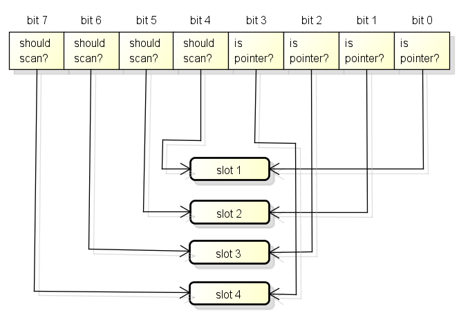

bitmap中的byte和arena的对应关系从末尾开始, 也就是随着内存分配会向两边扩展:

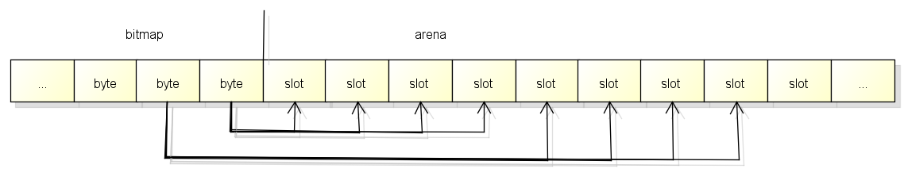

- `mheap.arena_start`: 将要分配给应用程序使用的空间。

## 1.3 内存分配器

Go 语言的**内存分配器**包含内存**管理单元runtime.mspan**、**线程缓存runtime.mcache**、**中心缓存runtime.mcentral**和**页堆runtime.mheap**几个重要组件。

需要先知道几个重要的概念：

- `object`: 对象，**用来存储一个变量数据内存空间**，一个 `span` 在初始化时，会被切割成一堆等大的 `object`。假设 `object` 的大小是 `16B`，`span` 大小是 `8K`，那么 `span` 中的 `page` 就会被初始化 `8K / 16B = 512` 个 `object`。所谓内存分配，就是分配一个 `object` 出去。
- `page`: 内存页，一块 `8K` 大小的内存空间。Go 与操作系统之间的内存申请和释放，都是以 `page` 为单位的。
- `span`: 内存块，**一个或多个连续的** `page` 组成一个 `span`。如果把 `page` 比喻成工人，`span` 可看成是小队，工人被分成若干个队伍，不同的队伍干不同的活。
- `sizeclass` : 空间规格，每个 `span` 都带有一个 `sizeclass`，标记着该 `span` 中的 `object` 是多大的。

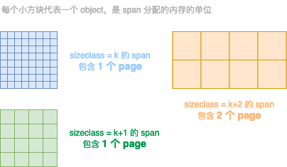

不同颜色代表不同的 `span`，不同 `span` 的 `sizeclass` 不同，表示里面的 `page` 将会按照不同的规格切割成一个个等大的 `object` 用作分配。

----------------------

<font color=red>**分配流程**</font>

1. Golang为每个线程分配了span的缓存，即mcache，避免多线程申请内存时不断的加锁。当 mcache 没有可用空间时，从 mcentral 的 mspans 列表获取一个新的所需大小规格的 mspan。
2. 每个mcentral对象只管理特定的class规格的span。事实上每种class都会对应一个mcentral。
3. Go 使用 mheap 对象管理堆，只有一个全局变量（mheap 也是go gc 工作的地方）。持有虚拟地址空间。mheap 存储了 mcentral 的数组。这个数组包含了各个的 span 规格的 mcentral。**由于我们有各个规格的 span 的 mcentral，当一个 mcache 从 mcentral 申请 mspan 时，只需要在独立的 mcentral 级别中使用锁，其它任何 mcache 在同一时间申请不同大小规格的 mspan 互不影响。**
4. 当 mcentral 列表为空时，mcentral 从 mheap 获取一系列页用于需要的大小规格的 span。

```go
//分配对象涉及的数据类型包含：
/*
	p: P是协程中的用于运行go代码的虚拟资源
	m: M目前代表系统线程
	g: G就是goroutine
	mspan: 用于分配对象的区块
	mcentral: 全局的mspan缓存, 一共有67*2=134个
	mheap: 用于管理heap的对象, 全局只有一个
*/
//几种重要结构的数据结构
type mspan struct {
    next *mspan             // next span in list, or nil if none
    prev *mspan             // previous span in list, or nil if none
    startAddr uintptr       // address of first byte of span aka s.base()
    npages    uintptr       // number of pages in span
    spanclass   spanClass     // size class and noscan (uint8)
    ...
    allocBits  *gcBits
	  gcmarkBits *gcBits        // 实现 span 的颜色标记
}
type mcache struct {
    // Tiny allocator
	tiny             uintptr
	tinyoffset       uintptr
	local_tinyallocs uintptr
}
type mcentral struct {
    lock      mutex     // 互斥锁
    spanclass spanClass // span class ID
    nonempty  mSpanList // non-empty 指还有空闲块的span列表
    empty     mSpanList // 指没有空闲块的span列表
    nmalloc uint64      // 已累计分配的对象个数
}
type mheap struct {
    lock      mutex
    spans []*mspan
    bitmap        uintptr 	//指向bitmap首地址，bitmap是从高地址向低地址增长的
    arena_start uintptr		//指示arena区首地址
    arena_used  uintptr		//指示arena区已使用地址位置
    central [67*2]struct {
        mcentral mcentral
        pad      [sys.CacheLineSize - unsafe.Sizeof(mcentral{})%sys.CacheLineSize]byte
    }
}
```


### 1.2.1 mcentral

**用途相同**的 `span` 会以链表的形式组织在一起。 这里的用途用 `sizeclass` 来表示，就是指该 `span` 用来存储哪种大小的对象。比如当分配一块大小为 `n` 的内存时，系统计算 `n` 应该使用哪种 `sizeclass`，然后根据 `sizeclass` 的值去找到一个可用的 `span` 来用作分配。其中 `sizeclass` 一共有 67 种（Go1.5 版本，后续版本可能会不会改变不好说），如图所示：

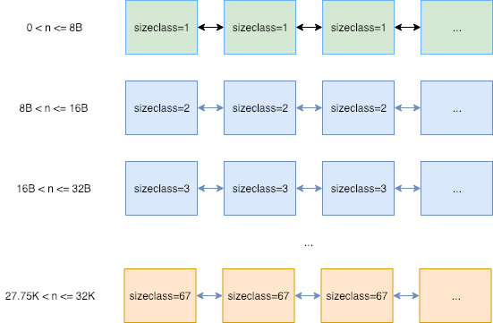

找到合适的 `span` 后，会从中取一个 `object` 返回给上层使用。每一种类型的`span` 被分别放在一个 mcentral 的结构中管理。

### 1.2.2 mcache

每一个 mcache 和每一个处理器(P) 是一一对应的，也就是说每一个 P 都有一个 mcache 成员。 Goroutine 申请内存时，首先从其所在的 P 的 mcache 中分配，如果 mcache 没有可用 `span`，再从 mcentral 中获取，并填充到 mcache 中。

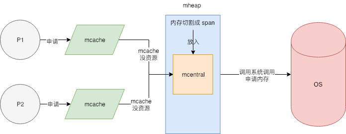

P是一个虚拟的资源, 同一时间只能有一个线程访问同一个P, 所以P中的数据不需要锁。为了分配对象时有更好的性能, 各个P中都有span的缓存(也叫mcache), 缓存的结构如下:

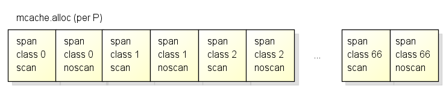

各个P中按span类型的不同, 有67*2=134个span的缓存，**其中scan和noscan的区别在于, 如果对象包含了指针, 分配对象时会使用scan的span, 如果对象不包含指针, 分配对象时会使用noscan的span.**

把span分为scan和noscan的意义在于, **GC扫描对象的时候对于noscan的span可以不去查看bitmap区域来标记子对象, 这样可以大幅提升标记的效率.**


------

1. **zero size** 有一些对象所需的内存大小是0，比如 `[0]int`, `struct{}`，这种类型的数据根本就不需要内存，所以没必要走上面那么复杂的逻辑。系统会直接返回一个固定的内存地址。源码如下：

```go
func mallocgc(size uintptr, typ *_type, flags uint32) unsafe.Pointer {
    // 申请的 0 大小空间的内存
    if size == 0 {
        return unsafe.Pointer(&zerobase)
    }
    //.....
}
```

2. **Tiny对象:**

`sizeclass=1` 的 span，用来给 `<= 8B` 的对象使用，所以像 `int32`, `byte`, `bool` 以及小字符串等常用的微小对象，都会使用 `sizeclass=1` 的 span，但分配给他们 `8B` 的空间，大部分是用不上的。并且这些类型使用频率非常高，就会导致出现大量的内部碎片。

所以 Go 尽量不使用 `sizeclass=1` 的 span， 而是将 `< 16B` 的对象为统一视为 tiny 对象(tinysize)。分配时，从 `sizeclass=2` 的 span 中获取一个 `16B` 的 object 用以分配。如果存储的对象小于 `16B`，这个空间会被暂时保存起来 (`mcache.tiny` 字段)，下次分配时会复用这个空间，直到这个 object 用完为止。

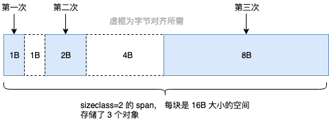

注：如果要存储的数据里有指针，即使 `<= 8B` 也不会作为 tiny 对象对待，而是正常使用 `sizeclass=1` 的 `span`。

3. **大对象**

如果一次性申请超过 `32K` 的内存，系统会直接绕过 mcache 和 mcentral，直接从 mheap 上获取。

### 1.2.3 bitmap


### 1.2.4 span

span是用于分配对象的区块, 下图是简单说明了Span的内部结构:

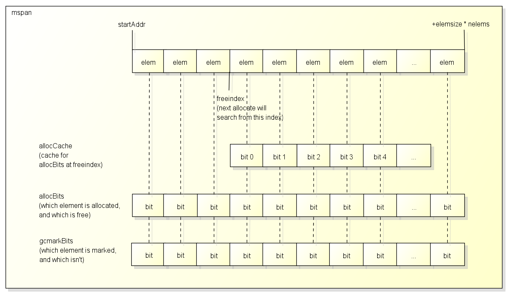

通常一个**span包含了多个大小相同的元素**, **一个元素会保存一个对象**, 除非:

- span用于保存**大对象**, 这种情况span只有一个元素
- span用于保存**极小对象**且**不包含指针**的对象(tiny object), 这种情况span会用一个元素保存多个对象

span中有一个freeindex标记下一次分配对象时应该开始搜索的地址, 分配后freeindex会增加，在freeindex之前的元素都是已分配的, 在freeindex之后的元素有可能已分配, 也有可能未分配。

- span每次GC以后都可能会回收掉一些元素, **allocBits**用于标记哪些元素是已分配的, 哪些元素是未分配的.
	使用freeindex + allocBits可以在分配时跳过已分配的元素, 把对象设置在未分配的元素中
- 因为每次都去访问allocBits效率会比较慢, span中有一个整数型的allocCache用于缓存freeindex开始的bitmap, 缓存的bit值与原值相反.
- gcmarkBits用于在gc时标记哪些对象存活, **每次gc以后gcmarkBits会变为allocBits**。

## 1.4 GC

GO的GC是并行GC, 也就是GC的大部分处理和普通的go代码是同时运行的, 这让GO的GC流程比较复杂.

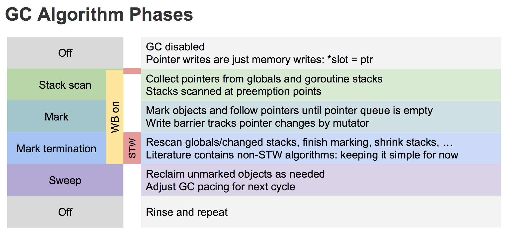

1. 正常情况下，写操作就是正常的赋值。

2. GC 开始，开启写屏障等准备工作。开启写屏障等准备工作需要短暂的 STW。

3. Stack scan 阶段，从全局空间和 goroutine 栈空间上收集变量。

4. Mark 阶段，执行上述的三色标记法，直到没有灰色对象。

5. Mark termination 阶段，开启 STW，回头重新扫描 root 区域新变量，对他们进行标记。

6. Sweep 阶段，关闭 STW 和 写屏障，对白色对象进行清除。

### 1.4.1 三色标记

为了能让标记过程也能并行，Go 采用了三色标记 + 写屏障的机制。它的步骤大致如下：

>在go内部对象并没有保存颜色的属性, 三色只是对它们的状态的描述,
>白色的对象在它所在的span的gcmarkBits中对应的bit为0,
>灰色的对象在它所在的span的gcmarkBits中对应的bit为1, **并且对象在标记队列中,**
>黑色的对象在它所在的span的gcmarkBits中对应的bit为1, **并且对象已经从标记队列中取出并处理.**
>
>GC的标记阶段会使用"标记队列"来确定所有可从根对象到达的对象都已标记, "灰色"的对象就是在**标记队列**中的对象.
>
>gc完成后, gcmarkBits会变为到allocBits然后重新分配一个全部为0的bitmap, 这样黑色的对象就变为了白色.

1. GC 开始时，认为所有 object 都是**白色**，即垃圾。
2. 从 root 区开始遍历，被触达的 object 置成**灰色**。
3. 遍历所有灰色 object，将他们内部的引用变量置成 **灰色**，自身置成 **黑色**
4. 循环第 3 步，直到没有灰色 object 了，只剩下了黑白两种，白色的都是垃圾。
5. **对于黑色 object，如果在标记期间发生了写操作，写屏障会在真正赋值前将新对象标记为灰色**。
6. 标记过程中，`mallocgc` 新分配的 object，会先被标记成黑色再返回。

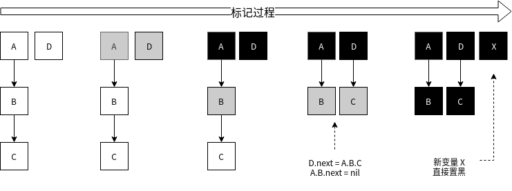

还有一种情况，标记过程中，堆上的 object 被赋值给了一个**栈上指针**，导致这个 object 没有被标记到。**因为对栈上指针进行写入，写屏障是检测不到的**。三色标记方式，需要在最后重新扫描一下所有全局变量和 goroutine 栈空间，Go 在 1.8 版本引入了**混合写屏障**，其会在赋值前，对旧数据置灰，再视情况对新值进行置灰。

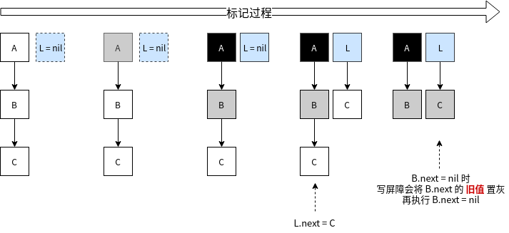

这样就不需要在最后回头重新扫描所有 Goroutine 的栈空间了，这使得整个 GC 过程 STW 几乎可以忽略不计了。

混合写屏障会有一点小小的代价，就是上例中如果 `C` 没有赋值给 `L`，用户执行 `B.next = nil` 后，`C` 的的确确变成了垃圾，而我们却把置灰了，使得 `C` 只能等到下一轮 GC 才能被回收了。

### 1.4.2 辅助GC

在GC执行的过程中如果同时运行的G分配了内存, 那么这个G会被要求辅助GC做一部分的工作。在GC的过程中同时运行的G称为"mutator", "mutator assist"机制就是G辅助GC做一部分工作的机制。

辅助GC做的工作有两种类型, 一种是标记(Mark), 另一种是清扫(Sweep).


# 2 并发

Go语言为并发编程而内置的上层API**基于CSP(communicating sequential processes，顺序通信进程**)模型。这就意味着显式锁都是可以避免的，因为Go 语言通过安全的通道发送和接受数据以实现同步，这大大地简化了并发程序的编写。

一般情况下，一个普通的桌面计算机跑十几二十个线程就有点负载过大了，但是同样这台机器却可以轻松地让成百上千甚至过万个goroutine进行资源竞争。

## 2.1 核心概念

### G (goroutine)

G是goroutine的头文字, goroutine可以解释为受管理的轻量线程, goroutine使用`go`关键词创建。

举例来说, `func main() { go other() }`, 这段代码创建了两个goroutine, 一个是main, 另一个是other, 注意main本身也是一个goroutine.

goroutine的新建, 休眠, 恢复, 停止都受到go运行时的管理.
goroutine执行异步操作时会进入休眠状态, 待操作完成后再恢复, 无需占用系统线程,
goroutine新建或恢复时会添加到运行队列, 等待M取出并运行.

### M (machine)

M是machine的头文字, 在当前版本的golang中**等同于系统线程**.
M可以运行两种代码:

- go代码, 即goroutine, M运行go代码需要一个P
- 原生代码, 例如阻塞的syscall, M运行原生代码不需要P

M会从运行队列中取出G, 然后运行G, 如果G运行完毕或者进入休眠状态, 则从运行队列中取出下一个G运行, 周而复始.
有时候G需要调用一些无法避免阻塞的原生代码, 这时M会释放持有的P并进入阻塞状态, 其他M会取得这个P并继续运行队列中的G.
go需要保证有足够的M可以运行G, 不让CPU闲着, 也需要保证M的数量不能过多.

### P (process)

P是process的头文字, 代表M运行G所需要的资源。虽然P的数量默认等于cpu核心数, 但可以通过环境变量`GOMAXPROC`修改, 在实际运行时P跟cpu核心并无任何关联。

P也可以理解为控制go代码的并行度的机制,
如果P的数量等于1, 代表当前最多只能有一个线程(M)执行go代码,
如果P的数量等于2, 代表当前最多只能有两个线程(M)执行go代码.
执行原生代码的线程数量不受P控制.

因为同一时间只有一个线程(M)可以拥有P, P中的数据都是锁自由(lock free)的, 读写这些数据的效率会非常的高.

## 2.2 go程数据结构

### G的状态

- 空闲中(_Gidle): 表示G刚刚新建, 仍未初始化
- 待运行(_Grunnable): 表示G在运行队列中, 等待M取出并运行
- 运行中(_Grunning): 表示M正在运行这个G, 这时候M会拥有一个P
- 系统调用中(_Gsyscall): 表示M正在运行这个G发起的系统调用, 这时候M并不拥有P
- 等待中(_Gwaiting): 表示G在等待某些条件完成, 这时候G不在运行也不在运行队列中(可能在channel的等待队列中)
- 已中止(_Gdead): 表示G未被使用, 可能已执行完毕(并在freelist中等待下次复用)
- 栈复制中(_Gcopystack): 表示G正在获取一个新的栈空间并把原来的内容复制过去(用于防止GC扫描)

### M的状态

M并没有像G和P一样的状态标记, 但可以认为一个M有以下的状态:

- 自旋中(spinning): M正在从运行队列获取G, 这时候M会拥有一个P
- 执行go代码中: M正在执行go代码, 这时候M会拥有一个P
- 执行原生代码中: M正在执行原生代码或者阻塞的syscall, 这时M并不拥有P
- 休眠中: M发现无待运行的G时会进入休眠, 并添加到空闲M链表中, 这时M并不拥有P

自旋中(spinning)这个状态非常重要, 是否需要唤醒或者创建新的M取决于当前自旋中的M的数量.

### P的状态

- 空闲中(_Pidle): 当M发现无待运行的G时会进入休眠, 这时M拥有的P会变为空闲并加到空闲P链表中
- 运行中(_Prunning): 当M拥有了一个P后, 这个P的状态就会变为运行中, M运行G会使用这个P中的资源
- 系统调用中(_Psyscall): 当go调用原生代码, 原生代码又反过来调用go代码时, 使用的P会变为此状态
- GC停止中(_Pgcstop): 当gc停止了整个世界(STW)时, P会变为此状态
- 已中止(_Pdead): 当P的数量在运行时改变, 且数量减少时多余的P会变为此状态

### 本地运行队列

在go中有多个运行队列可以保存待运行(_Grunnable)的G, 它们分别是各个P中的**本地运行队列**和**全局运行队列**.
入队待运行的G时会优先加到当前P的本地运行队列, M获取待运行的G时也会优先从拥有的P的本地运行队列获取,
本地运行队列入队和出队不需要使用线程锁.

本地运行队列有数量限制, 当数量达到256个时会入队到全局运行队列.
本地运行队列的数据结构是[环形队列](https://en.wikipedia.org/wiki/Circular_buffer), 由一个256长度的数组和两个序号(head, tail)组成.

当M从P的本地运行队列获取G时, 如果发现本地队列为空会尝试从其他P盗取一半的G过来,这个机制叫做[Work Stealing](http://supertech.csail.mit.edu/papers/steal.pdf)

### 全局运行队列

全局运行队列保存在全局变量`sched`中, 全局运行队列入队和出队需要使用线程锁。全局运行队列的数据结构是链表, 由两个指针(head, tail)组成.

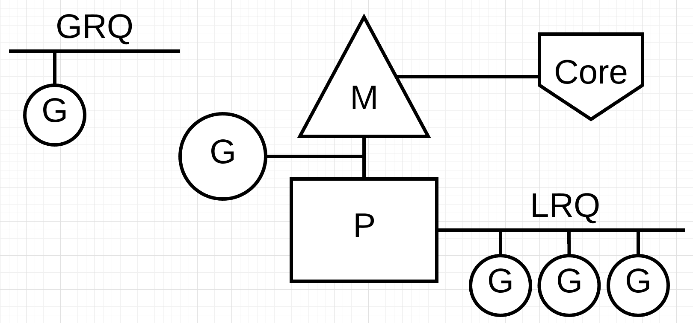

### 空闲M链表

当M发现无待运行的G时会进入休眠, 并添加到空闲M链表中, 空闲M链表保存在全局变量`sched`.
进入休眠的M会等待一个信号量(m.park), 唤醒休眠的M会使用这个信号量.

go需要保证有足够的M可以运行G, 是通过这样的机制实现的:

- 入队待运行的G后, 如果当前无自旋的M但是有空闲的P, 就唤醒或者新建一个M
- 当M离开自旋状态并准备运行出队的G时, 如果当前无自旋的M但是有空闲的P, 就唤醒或者新建一个M
- 当M离开自旋状态并准备休眠时, 会在离开自旋状态后再次检查所有运行队列, 如果有待运行的G则重新进入自旋状态

因为"入队待运行的G"和"M离开自旋状态"会同时进行, go会使用这样的检查顺序:

入队待运行的G => 内存屏障 => 检查当前自旋的M数量 => 唤醒或者新建一个M
减少当前自旋的M数量 => 内存屏障 => 检查所有运行队列是否有待运行的G => 休眠

这样可以保证不会出现待运行的G入队了, 也有空闲的资源P, 但无M去执行的情况.

### 空闲P链表

当P的本地运行队列中的所有G都运行完毕, 又不能从其他地方拿到G时,
拥有P的M会释放P并进入休眠状态, 释放的P会变为空闲状态并加到空闲P链表中, 空闲P链表保存在全局变量`sched`
下次待运行的G入队时如果发现有空闲的P, 但是又没有自旋中的M时会唤醒或者新建一个M, M会拥有这个P, P会重新变为运行中的状态.

## 2.3 多任务竞争问题

```go
package main

import (
	"fmt"
	"time"
)

var c = make(chan int) //定义管道
func Printer(str string) {
	for _, data := range str {
		fmt.Printf("%c",data)
		time.Sleep(time.Second)
	}
	fmt.Println()
}

//让person1先执行
func person1() {
	Printer("hello")
	c<-1
}

func person2() {
	<-c //从c中取数据，如果c中没有数据，就阻塞
	Printer("world")
}

func main() {
	//新建2个goroutine，代表2个人，2个人同时使用打印机
	go person1()
	go person2()
	for  {

	}
}

```

## 2.4 channel

goroutine运行在相同的地址空间，因此访问共享内存必须做好同步。**goroutine奉行通过通信来共享内存，而不是共享内存来通信。**引用类型channel是CSP模式的具体实现，用于多个goroutine 通讯。其内部实现了同步，确保并发安全。

无缓冲channel: 如果channel中有数据，则放数据会被阻塞，如果没有数据，则取数据会被阻塞，必须存和取同时存在

有缓存channel：channel满了就不能放数据了，channel空的时候就不能取数据。

关闭channel：

```go
package main

import "fmt"

func main() {
   ch:=make(chan int)
   go func() {
      for i := 0; i < 5; i++ {
         ch<-i
      }
      close(ch)//不需要写数据了
   }()
  //range遍历会将channel中的元素取出来
  /*	
  for num := range ch {
		fmt.Println("num=",num)
	}
	*/
   for  {
      if num,ok:=<-ch;ok==true{
         fmt.Println("num=",num)
      }else{
         break //通道关闭
      }
   }
}
```


<font color=red>**单向channel**</font>

```go
var ch1 chan int //可读可写的channel
var ch2 chan<- int //可写的channel
var ch3 <-chan int //可读的channel

//生产者消费者
package main

import "fmt"

//生产者消费者模式
//生产者只可写
func producer(out chan<- int)  {
	for i := 0; i < 10; i++ {
		out<-i*i
	}
	close(out)
}
//消费者只可读
func consumer(out <-chan int)  {
	for  num := range out {
		fmt.Println(num)
	}
}
func main() {
	ch:=make(chan int)  //可读可写的channel
	go producer(ch)
	consumer(ch)
}

```


# 3 包

## 3.1 reflect

接口类型的变量存储了一对内容：即赋予**该变量的具体值**，以及**该值的类型描述符**。 更准确地说，接口的值是实现了该接口的底层具体数据条目，而类型则描述了该条目的完整类型。

```go
var r io.Reader
tty, err := os.OpenFile("/dev/tty", os.O_RDWR, 0)
if err != nil {
    return nil, err
}
r = tty
```

`r` 包含的 (值, 类型) 对可以形式化地描述为（`tty`，`*os.File`） 注意，类型 `*os.File` 还实现了除 `Read` 以外的其它方法：尽管该接口值只提供了访问 `Read` 方法的能力，但其内部却携带了有关该值的所有类型信息。 这就是我们可以写出这种代码的原因：

```go
var w io.Writer
w = r.(io.Writer)
```

### 3.1.1 从接口值可反射出对象。

从基本层面上看，反射只是一种**检查存储在接口变量**中的“类型-值”对的机制。首先，我们需要了解 [reflect 包](https://go-zh.org/pkg/reflect)中的两种类型： [Type](https://go-zh.org/pkg/reflect/#Type) 和 [Value](https://go-zh.org/pkg/reflect/#Value)，这两种类型可用来访问接口变量的内容。 还有两个简单的函数，叫做 `reflect.TypeOf` 和 `reflect.ValueOf` ， 它们用来从接口值中分别获取 `reflect.Type` 和 `reflect.Value` 。

`reflect.TypeOf` 的签名包含了一个空接口：

```go
// TypeOf 返回 interface{} 中的值的反射类型 Type。
func TypeOf(i interface{}) Type
```

当我们调用 `reflect.TypeOf(x)` 时， `x` 首先会被存储在一个空接口中， 然后它会作为实参被传入； `reflect.TypeOf` 通过解包该空接口来还原其类型信息。

`reflect.Type` 和 `reflect.Value` 都有许多方法来让我们检测并操作它们。 

- 一个重要的例子就是 `Value` 拥有一个 `Type` 方法，它会返回 `reflect.Value` 的 `Type` 。
- 另外就是 `Type` 和 `Value` 都有一个 `Kind` 方法，它会返回一个常量来表明条目的类型： `Uint 、 Float64` 或 `Slice` 等等。
- 同样， `Value` 拥有像 `Int` 和 `Float` 这样的方法来让我们获取存储在内部的值

`Kind` 描述了其基本类型，而非静态类型，

```go
type MyInt int
var x MyInt = 7
v := reflect.ValueOf(x)
```

那么 `v` 的 `Kind` 仍为 `reflect.Int` ，尽管 `x` 的静态类型为 `MyInt` 而非 `int` 。换句话说， `Kind` 无法区分 `int` 和 `MyInt` ，而 `Type` 则可以。

### 3.1.2 从对象可反射出接口值

给定一个 `reflect.Value` ，我们可以使用 `Interface` 方法还原其接口值；在效果上，该方法会将类型与值的信息打包成接口表示，并返回其结果：

```go
// Interface 将 v 的值返回成 interface{}。
func (v Value) Interface() interface{}

y := v.Interface().(float64) // y will have type float64.
fmt.Println(y)
```

`fmt.Println` 与 `fmt.Printf` 等都会将实参作为空接口值传递，它们会被包 `fmt` 进行内部解包， 就像我们刚做的那样。因此，正确地打印出 `reflect.Value` 内容的方法就是 将 `Interface` 方法的结果传至格式化打印功能：

```go
fmt.Println(v.Interface())
```

### 3.1.3  反射修改值

```go
var x float64 = 3.4
v := reflect.ValueOf(x)
v.SetFloat(7.1) // Error: will panic.
```

如果你运行这段代码，它就会报出神秘的恐慌信息：

```go
panic: reflect.Value.SetFloat using unaddressable value
```

其问题的根源不在于值 `7.1` 能不能寻址，而在于 `v` 不可设置。 可设置性是反射值 `Value` 的一种属性，而且并不是所有的反射值都拥有它。

`Value` 的 `CanSet` 方法会报告 `Value` 的可设置性。 在我们的例子中，

```go
var x float64 = 3.4
v := reflect.ValueOf(x)
fmt.Println("settability of v:", v.CanSet())
```

会打印出

```go
settability of v: false
```

可设置性有点像可寻址性，不过它更加严格。**它是反射对象能否修改其创建之初的实际值的一种属性**。 可设置性决定了反射对象能否保存原始条目。

```go
var x float64 = 3.4
v := reflect.ValueOf(x)
```

**将 `x` 的一份副本传入了 `reflect.ValueOf` ， 因此该接口值也就作为传递给 `reflect.ValueOf` 的实参创建了一份 `x` 的副本，而非 `x` 本身。**

如果我们传入目标的指针

```
var x float64 = 3.4
p := reflect.ValueOf(&x) // 注意：获取 x 的地址
fmt.Println("type of p:", p.Type())
fmt.Println("settability of p:", p.CanSet())
```

目前会输出

```go
type of p: *float64
settability of p: false
```

反射对象 `p` 并不是可设置的，不过我们也不想设置 `p` ， 而（效果上）是 `*p` 。为获得 `p` 指向的内容，我们调用 `Value` 的 `Elem` 方法，它会间接通过指针，并将结构保存到叫做 `v` 的反射值 `Value` 中：

```go
v := p.Elem()
fmt.Println("settability of v:", v.CanSet())
```

因此最终我们可使用 `v.SetFloat` 来修改 `x` 的值：

```go
v.SetFloat(7.1)
fmt.Println(v.Interface())
fmt.Println(x)
```

反射可能很难理解，但语言做了它应该做的，尽管反射类型 `Type` 和值 `Value` 隐藏了发生的事情。你只要记住反射值需要某些东西的地址来修改它所代表的东西即可。

### 3.1.4 结构体

```go
type T struct {
    A int
    B string
}
t := T{23, "skidoo"}
s := reflect.ValueOf(&t).Elem()
typeOfT := s.Type()
for i := 0; i < s.NumField(); i++ {
    f := s.Field(i)
    fmt.Printf("%d: %s %s = %v\n", i,
        typeOfT.Field(i).Name, f.Type(), f.Interface())
}
```

这里还有一个关于可设置性的要点： `T` 的字段名必须大写（已导出）， 因为只有已导出的字段才是可设置的。

由于 `s` 包含了可设置的反射对象，因此我们可以修改该结构体的字段：

```go
s.Field(0).SetInt(77)
s.Field(1).SetString("Sunset Strip")
fmt.Println("t is now", t)
```

## 3.2 regexp

正则表达式包

```go
import (
	"fmt"
	"regexp"
)

func main() {
	buf := "3.12 621 545 3.214"
	//解析正则表达式，
	reg := regexp.MustCompile(`\d+\.\d+`)
	if reg == nil {
		return
	}
	//匹配字符
	result := reg.FindAllString(buf, -1)
	fmt.Println(result)
}

```

## 3.3  JSON

GO语言内置`encoding/json`标准库

在线json转换: www.json.cn

```go
package main

import (
	"encoding/json"
	"fmt"
)

//要生成JSON，成员首字符必须大写
type IT struct {
	Company  string `json:"company"`
	Subjects []string `json:"subjects"`
	IsOk     bool `json:"isok"`
	Price    float64 `json:"price"`
}

func main() {
	//定义一个结构体对象
	s := IT{"itcast", []string{"GO", "C++", "Python", "Java"}, true, 666.666}
  //通过map生成json,创建map，后续一样
  /*
  m := make(map[string]interface{})
	m["company"] = "itcast"
	m["subjects"] = []string{"GO", "C++", "Python", "Java"}
	m["isok"] = true
	m["price"] = 6666.66
  */
	
	//编码，根据结构体生成JSON
	//sjson, err := json.Marshal(s)
  sjson, err := json.MarshalIndent(s, "", " ") //格式化
	if err != nil {
		fmt.Println("err==", err)
		return
	}
	fmt.Println(string(sjson))
}


```

json解析为对象

```go

package main

import (
	"encoding/json"
	"fmt"
)

//要生成JSON，成员首字符必须大写
type IT struct {
	Company  string
	Subjects []string
	IsOk     bool
	Price    float64
}

func main() {
	jsonbuf := `
	{
	"company": "itcast",
	"subjects": [
		"GO",
		"C++",
		"Python",
		"Java"
	],
	"isok":true,
	"price":666.666
}
`
	var tmp IT
	err := json.Unmarshal([]byte(jsonbuf), &tmp)
	if err != nil {
		fmt.Println("err==", err)
		return
	}
	fmt.Println(tmp)
}

```

## 3.4 文件操作 os包

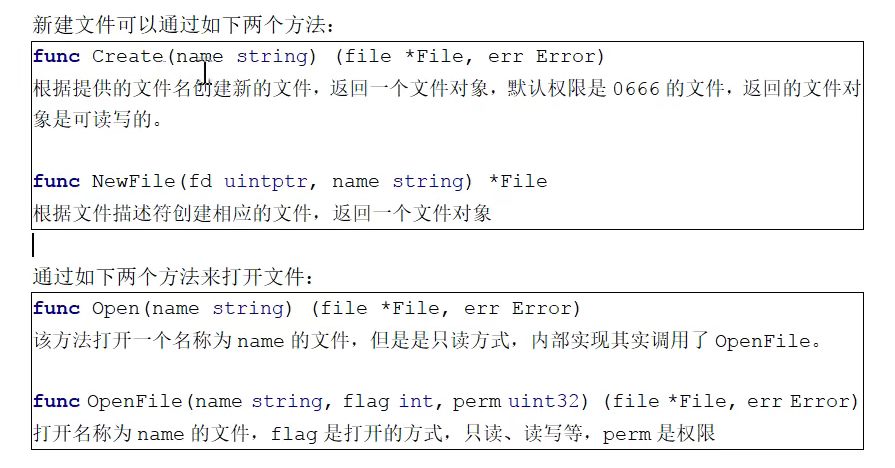

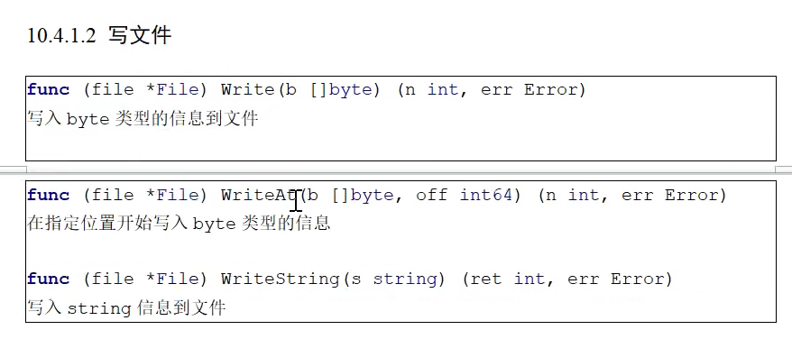

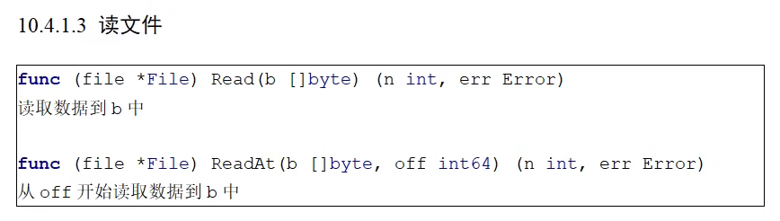

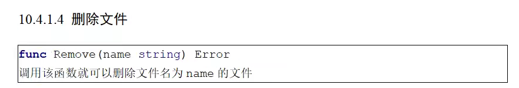

### 3.4.1 标准输入输出

```go
import (
	"fmt"
	"os"
)

func main() {
	//os.Stdout.Close() //关闭后，无法输出
	/*
		往标准输出设备写内容
		标准设备os.Stdout默认为打开
	*/
	fmt.Println("are u ok?")
	os.Stdout.WriteString("are u ok?")

	var a int
	fmt.Print("输入a:")
	//os.Stdin.Close() //关闭后无法输入
	fmt.Scan(&a) //从标准输入设备中读取内容，放在a中
	fmt.Println(a)
}
```

### 3.4.2 文件操作

```go
package main

import (
	"bufio"
	"fmt"
	"io"
	"os"
)

func WriteFile(path string) {
	//打开文件，新建文件
	f, err := os.Create(path)
	if err != nil {
		fmt.Println("err=", err)
		return
	}
	//使用完毕关闭文件
	defer func() {
		err := f.Close()
		if err != nil {
			panic("文件关闭错误")
		}
	}()

	for i := 0; i < 10; i++ {
		//i=1\n" 这个字符串存储到buf中
		buf := fmt.Sprintf("i=%d\n", i)
		f.WriteString(buf)
	}
}

func ReadFile(path string) {
	//打开文件
	f, err := os.Open(path)
	if err != nil {
		fmt.Println("err=", err)
		return
	}
	//关闭文件
	defer func() {
		err := f.Close()
		if err != nil {
			panic("文件关闭错误")
		}
	}()

	buf := make([]byte, 1024*2)

	//n表示从文件读取内容的长度
	n, err1 := f.Read(buf)
	if err1 != nil && err1 != io.EOF { //文件出错，同时没有到结尾
		fmt.Println("err1=", err1)
		return
	}
	fmt.Println("buf=", string(buf[:n]))
}

//读取一行
func ReadFileLine(path string) {
	//打开文件
	f, err := os.Open(path)
	if err != nil {
		fmt.Println("err=", err)
		return
	}
	//关闭文件
	defer func() {
		err := f.Close()
		if err != nil {
			panic("文件关闭错误")
		}
	}()

	//新建一个缓冲区，吧内容先放到缓冲区
	r := bufio.NewReader(f)
	for {
		buf, err := r.ReadBytes('\n')
		if err != nil {
			if err == io.EOF {
				break
			}
			fmt.Println("err=", err)
		}
		fmt.Println("buf=", string(buf))
	}
}

func main() {
	path := "./demo.txt"
	//WriteFile(path)
	//ReadFile(path)
	ReadFileLine(path)
}

```

## 3.5 runtime

### 3.5.1 Gosched

runtime.Gosched(用于让出 CPU时间片，让出当前 goroutine 的执行权限，调度器安排其他等待的任务运行，并在下次某个时候从该位置恢复执行。

```go
import (
   "fmt"
   "runtime"
)

func main() {
   go func() {
      for i := 0; i < 5; i++ {
         fmt.Println("go")
      }
   }()

   for i := 0; i < 2; i++ {
      //让出时间片，先让别的goroutine执行，它执行完在执行此goroutine
      runtime.Gosched()
      fmt.Println("hello")
   }
}
```

### 3.5.2 Goexit

```go
package main

import (
   "fmt"
   "runtime"
)

func test() {
   defer fmt.Println("ccccc")
   //return //无法执行dddddd"
   runtime.Goexit()//终止所在的携程 无法执行dddddd和bbbbbb
   fmt.Println("dddddd")
}
func main() {
   go func() {
      fmt.Println("aaaaaa")
      test()
      fmt.Println("bbbbbb")
   }()
   //不然主函数退出
   for {

   }
}
```

### 3.5.3 GOMAXPROCS

调用runtime.GOMAXPROCS(用来设置可以并行计算的CPU核数的最大值，并返回之前的值。

```go
package main

import (
   "fmt"
   "runtime"
)

func main() {
   //n表示默认有多少核运算
   n:=runtime.GOMAXPROCS(2) //指定以双核运算
   fmt.Println(n)
   for {
      go fmt.Print(1)
      fmt.Print(0)
   }
}
```

## 3.6 time包

```go
//实现延时功能
package main

import (
   "fmt"
   "time"
)

func main()  {
   <-time.After(2*time.Second)
   fmt.Println("时间到")
}

func main2()  {
   time.Sleep(2*time.Second)
   fmt.Println("时间到")
}

func main1() {
   timer:=time.NewTimer(2*time.Second)
   <-timer.C
   fmt.Println("时间到")
}
```


# 4 结构体

优雅的实现初始化对象，带参数的。

```go
package main

import "fmt"

//结构体
type Foo struct {
	key string //必须传入的参数
	op options //带有初始值的参数
}

//管理带默认值的变量
type options struct {
	num int
	str string
}

type modOptions func(op *options)

func WithNum(num int) modOptions  {
	return func(op *options) {
		op.num=num
	}
}

func WithStr(str string) modOptions  {
	return func(op *options) {
		op.str=str
	}
}
func (this *Foo) String() string {
	return fmt.Sprintln(this.key,this.op.num,this.op.str)
}

//类似构造函数，产生一个Foo对象
func New(key string,modOp ...modOptions) *Foo {
	//设置默认值
	op:=options{
		num: 100,
		str: "hello",
	}
	for _, fn := range modOp {
		fn(&op)
	}
	return &Foo{
		key: key,
		op: op,
	}
}

func main() {
	//new对象
	object:=New("xiaowu",WithNum(12),WithStr("world"))
	fmt.Println(object)
}
```

